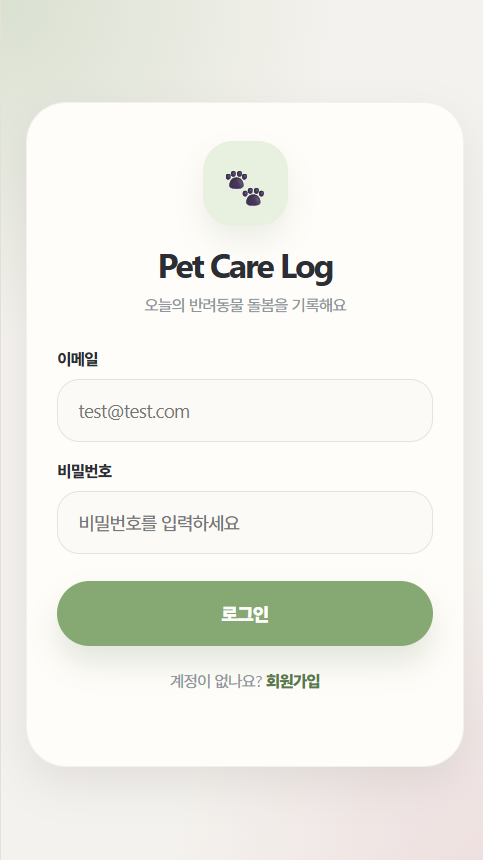
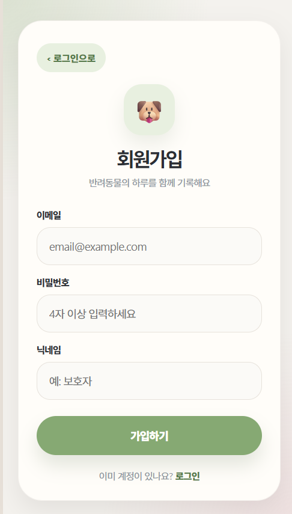
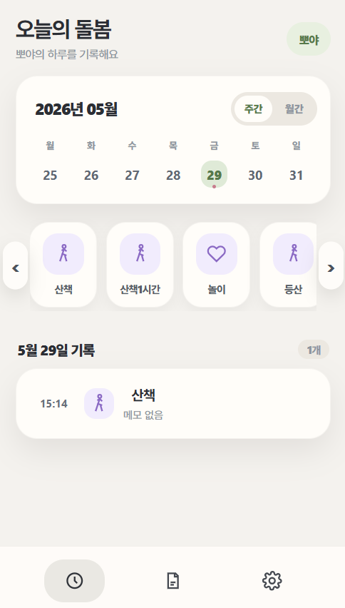
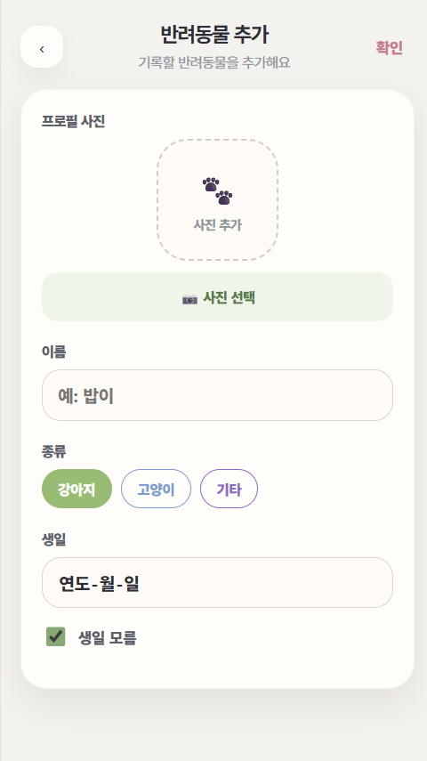
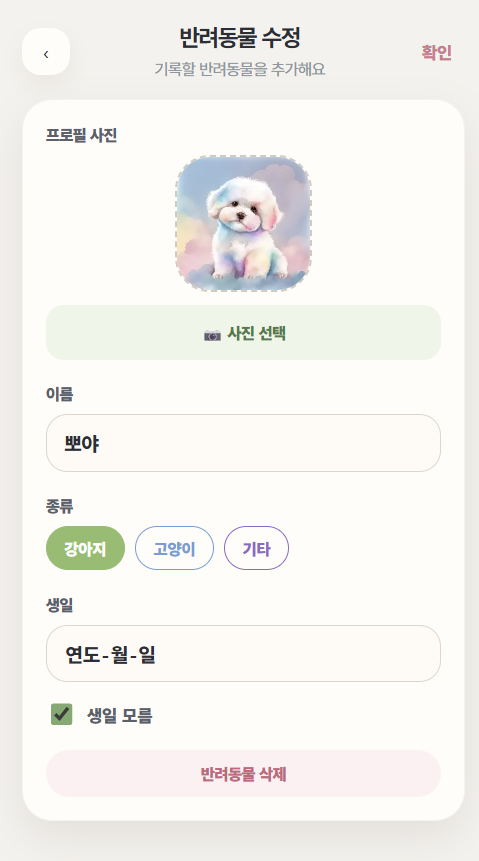
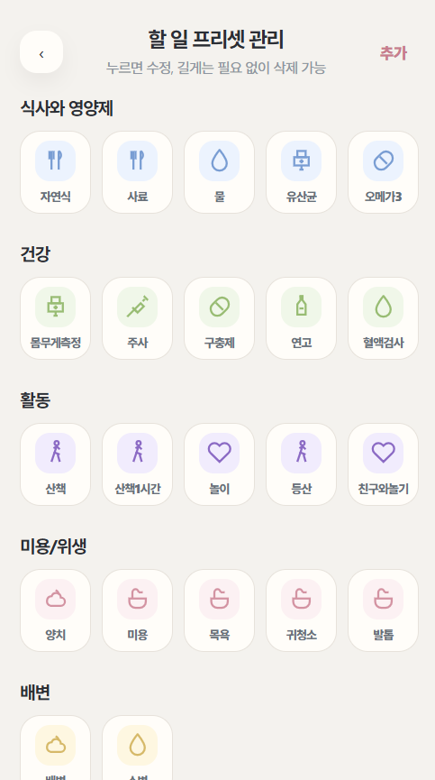
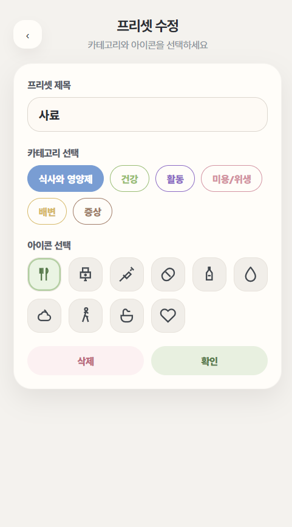
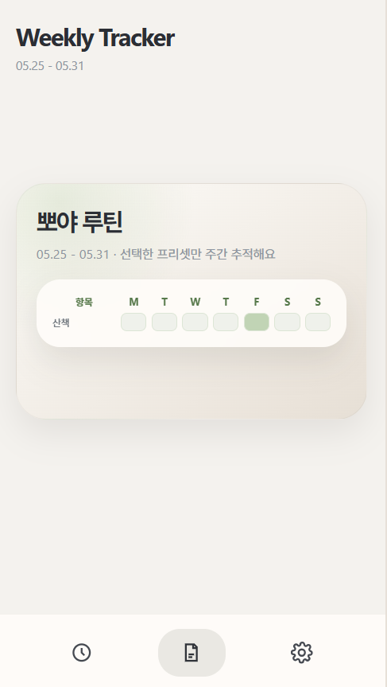
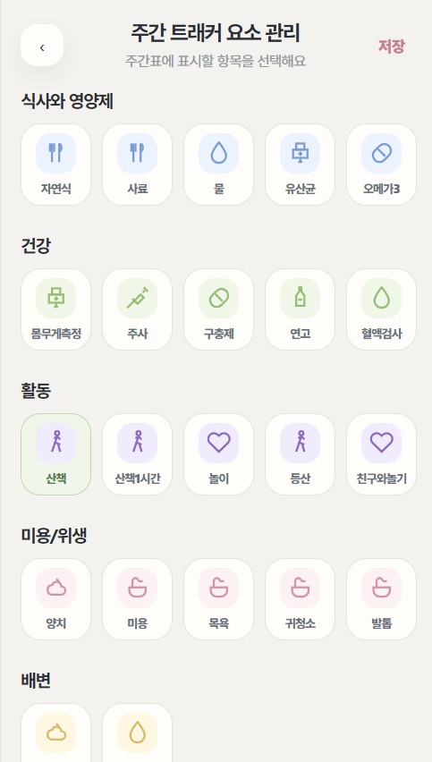

# PetCareLog

> 반려동물의 일상 돌봄 기록을 쉽고 꾸준하게 관리할 수 있는 웹 애플리케이션입니다.
> 사용자는 반려동물을 등록하고, 날짜별 케어 기록과 맞춤형 프리셋을 활용하여 사료, 물, 산책, 목욕, 병원 방문 등의 돌봄 이력을 관리할 수 있습니다.

<br>

<a id="overview"></a>

## 📌 프로젝트 개요

PetCareLog는 반려동물 보호자가 매일 반복되는 돌봄 활동을 간편하게 기록하고 확인할 수 있도록 만든 서비스입니다.

단순한 메모 앱이 아니라, **사용자 인증**, **반려동물별 데이터 분리**, **프리셋 기반 빠른 기록**, **이미지 업로드**, **Redis 세션 관리**, **AWS/Kubernetes 배포**, **Prometheus 기반 모니터링**까지 고려하여 구성했습니다.

<br>

<a id="screenshots"></a>

## 📷 애플리케이션 화면

| 로그인 | 회원가입 |
|---|---|
|  |  |

| 메인 화면(돌봄 기록) | 반려동물 관리 및 설정 |
|---|---|
|  |  |

| 반려동물 추가 | 반려동물 수정 |
|---|---|
|  |  |

| 프리셋 관리 | 프리셋 추가 | 프리셋 수정/삭제 |
|---|---|---|
|  |  |  |

| 주간 트래커  | 주간 트래킹 선택 |
|---|---|
|  |  |

<br>


## 목차

- [프로젝트 개요](#overview)
- [애플리케이션 화면](#screenshots)
- [주요 기능](#features)
- [기술 스택](#tech-stack)
- [프로젝트 구조](#project-structure)
- [사전 요구 사항](#prerequisites)
- [환경 변수](#environment-variables)
- [설치 방법](#installation)
- [Docker 실행 방법](#docker)
- [사용법](#usage)
- [주요 API](#api)
- [배포 및 운영 구조](#deployment)
- [모니터링](#monitoring)
- [저자 및 기여자](#contributors)

<br>

<a id="features"></a>

## ✅ 주요 기능

### 👤 1. 회원가입 및 로그인

* 이메일, 비밀번호, 닉네임을 이용한 회원가입
* Spring Security 기반 Form Login
* BCrypt를 이용한 비밀번호 암호화
* Redis 기반 세션 저장
* 로그인 사용자 기준 데이터 관리

<br>

### 🐶 2. 반려동물 관리

* 반려동물 등록, 조회, 수정, 삭제
* 이름, 종류, 생년월일 관리
* 사용자별 반려동물 목록 분리
* 반려동물 삭제 시 관련 이미지 함께 정리

<br>

### 🖼️ 3. 반려동물 이미지 업로드

* 반려동물 프로필 이미지 업로드
* Amazon S3 기반 이미지 저장
* 기존 이미지 교체 및 삭제 지원
* 지원 확장자: `jpg`, `jpeg`, `png`, `gif`, `webp`
* 최대 파일 크기: `10MB`

<br>

### 📝 4. 돌봄 기록 관리

* 반려동물별 돌봄 기록 등록, 조회, 수정, 삭제
* 날짜별 기록 조회
* 기록 상세 조회
* 메모 및 기록 시간 수정
* 월별 기록이 존재하는 날짜 조회

<br>

### ⚡5. 빠른 돌봄 기록 등록

* 사용자가 선택한 프리셋을 기반으로 빠르게 기록 생성
* 프리셋의 이름, 카테고리, 아이콘, 색상 자동 반영
* 기록 시간이 없으면 현재 시간으로 자동 저장

<br>

### 🎛️ 6. 돌봄 프리셋 관리

* 기본 프리셋 제공
* 사용자 정의 프리셋 생성, 수정, 삭제
* 카테고리별 프리셋 조회
* 삭제 시 실제 삭제가 아닌 비활성화 방식으로 처리

<br>

### ⭐ 7. 주간 트래커

* 자주 확인하는 프리셋을 추적 항목으로 설정
* 일주일 단위 돌봄 수행 여부 확인
* 사용자별 트래커 설정 저장

<br>

### 📊 8. 헬스 체크 및 모니터링

* `/api/health` 헬스 체크 API 제공
* Spring Boot Actuator 기반 상태 확인
* Prometheus 메트릭 수집 지원
* Grafana 대시보드를 통한 애플리케이션 상태 시각화

<br>

<a id="tech-stack"></a>

## 💻 기술 스택

### ▶ Backend

| 구분         | 기술                         |
| ---------- | -------------------------- |
| Language   | Java 17                    |
| Framework  | Spring Boot 3.4.5          |
| Security   | Spring Security            |
| ORM        | Spring Data JPA, Hibernate |
| Validation | Spring Validation          |
| Session    | Spring Session Redis       |
| Build Tool | Maven                      |

<br>

### ▶ Frontend

| 구분              | 기술                           |
| --------------- | ---------------------------- |
| View            | HTML                         |
| Style           | CSS                          |
| Script          | JavaScript                   |
| Static Resource | Spring Boot Static Resources |

<br>

### ▶ Database / Storage

| 구분             | 기술                         |
| -------------- | -------------------------- |
| RDBMS          | MySQL                      |
| Session Store  | Redis / Amazon ElastiCache |
| Object Storage | Amazon S3                  |

<br>

### ▶ Infra / DevOps

| 구분            | 기술                                                    |
| ------------- | ----------------------------------------------------- |
| Container     | Docker                                                |
| Registry      | Amazon ECR                                            |
| CI/CD         | GitHub Actions                                        |
| Orchestration | Kubernetes, Amazon EKS                                |
| GitOps        | Argo CD                                               |
| IaC           | Terraform                                             |
| Monitoring    | Prometheus, Grafana, Spring Boot Actuator, Micrometer |

<br>

<a id="project-structure"></a>

## ✅ 프로젝트 구조

```text
petcarelog
├── .github
│   └── workflows
│       └── build-and-push.yml
├── src
│   ├── main
│   │   ├── java/com/example/petcarelog
│   │   │   ├── carelog        # 돌봄 기록 도메인
│   │   │   ├── common         # 공통 엔티티
│   │   │   ├── config         # Security, Redis, S3 설정
│   │   │   ├── global         # 기본 데이터 초기화
│   │   │   ├── health         # 헬스 체크 API
│   │   │   ├── pet            # 반려동물 도메인
│   │   │   ├── preset         # 돌봄 프리셋 도메인
│   │   │   └── user           # 사용자 및 인증 도메인
│   │   └── resources
│   │       ├── db
│   │       │   ├── DDL.sql
│   │       │   └── DML.sql
│   │       ├── static
│   │       │   ├── css
│   │       │   ├── js
│   │       │   ├── index.html
│   │       │   ├── login.html
│   │       │   └── signup.html
│   │       ├── application.yaml
│   │       └── application-local-example.yaml
│   └── test
├── Dockerfile
├── pom.xml
├── mvnw
└── mvnw.cmd
```

<br>

<a id="prerequisites"></a>

## ✅ 사전 요구 사항

로컬 환경에서 프로젝트를 실행하기 위해 다음 도구가 필요합니다.

| 도구      |         권장 버전 | 설명                  |
| ------- | ------------: | ------------------- |
| Java    |            17 | Spring Boot 실행      |
| Maven   | Wrapper 사용 가능 | 프로젝트 빌드             |
| MySQL   |        8.x 권장 | 애플리케이션 데이터 저장       |
| Redis   |        7.x 권장 | 로그인 세션 저장           |
| Docker  |         선택 사항 | 컨테이너 빌드 및 실행        |
| AWS CLI |         선택 사항 | S3/ECR 등 AWS 연동 테스트 |

<br>

<a id="environment-variables"></a>

## ✅ 환경 변수

`application.yaml`은 환경 변수를 기반으로 DB, Redis, S3 설정을 주입받습니다.

| 환경 변수 | 설명 |
|---|---|
| `DB_HOST` | MySQL 호스트 |
| `DB_PORT` | MySQL 포트 |
| `DB_NAME` | 데이터베이스 이름 |
| `DB_USERNAME` | 데이터베이스 사용자명 |
| `DB_PASSWORD` | 데이터베이스 비밀번호 |
| `REDIS_HOST` | Redis 호스트 |
| `REDIS_PORT` | Redis 포트 |
| `REDIS_USERNAME` | Redis 사용자명 |
| `REDIS_PASSWORD` | Redis 비밀번호 |
| `REDIS_SSL_ENABLED` | Redis SSL 사용 여부 |
| `AWS_REGION` | AWS 리전 |
| `S3_BUCKET_NAME` | S3 버킷 이름 |
| `S3_PET_IMAGE_PREFIX` | 반려동물 이미지 저장 경로 prefix |

> 실제 비밀번호, AWS Access Key, DB 접속 정보는 GitHub에 커밋하지 않습니다.  
> 로컬 실행용 설정은 `application-local-example.yaml`을 참고하여 별도의 `application-local.yaml`로 관리하는 것을 권장합니다.

<br>

### ▶ GitHub Actions Variables & Secrets

GitHub Actions에서는 Docker 이미지를 빌드한 뒤 Amazon ECR에 Push하고,  
`team5-config` 저장소의 Kubernetes Manifest 이미지 태그를 업데이트합니다.

AWS 인증은 Access Key 방식이 아니라 **GitHub OIDC 기반 IAM Role Assume 방식**을 사용합니다.

#### ‣ Repository Variables

| 이름 | 설명 |
|---|---|
| `AWS_REGION` | AWS 리전 |
| `ECR_DEV_REPOSITORY` | dev 환경 ECR Repository 이름 |
| `ECR_PROD_REPOSITORY` | prod 환경 ECR Repository 이름 |
| `AWS_DEV_ROLE_ARN` | dev 배포용 GitHub Actions IAM Role ARN |
| `AWS_PROD_ROLE_ARN` | prod 배포용 GitHub Actions IAM Role ARN |

#### ‣ Repository Secrets

| 이름 | 설명 |
|---|---|
| `CONFIG_REPO_TOKEN` | `team5-config` 저장소의 Kubernetes Manifest 이미지 태그를 수정하기 위한 GitHub Token |

> GitHub Variables에는 비교적 민감하지 않은 설정값을 저장합니다.  
> GitHub Secrets에는 외부에 노출되면 안 되는 토큰이나 인증 정보를 저장합니다.  
> 실제 ARN, 토큰, 계정 ID, Access Key 값은 README에 직접 작성하지 않습니다.
<br>

<a id="installation"></a>

## ✅ 설치 방법

### 1. 저장소 클론

```bash
git clone <repository-url>
cd petcarelog
```

<br>

### 2. MySQL 데이터베이스 생성

```sql
CREATE DATABASE petcarelog_dev
  DEFAULT CHARACTER SET utf8mb4
  COLLATE utf8mb4_unicode_ci;
```

필요한 경우 `src/main/resources/db/DDL.sql`, `src/main/resources/db/DML.sql`을 참고하여 초기 데이터를 구성합니다.

<br>

### 3. Redis 실행

로컬에 Redis가 설치되어 있다면 다음과 같이 실행합니다.

```bash
redis-server
```

Docker를 사용하는 경우 다음 명령어로 실행할 수 있습니다.

```bash
docker run -d \
  --name petcarelog-redis \
  -p 6379:6379 \
  redis:7
```

<br>

### 4. 로컬 설정 파일 생성

`application-local-example.yaml`을 복사하여 로컬 설정 파일을 만듭니다.

```bash
cp src/main/resources/application-local-example.yaml src/main/resources/application-local.yaml
```

Windows PowerShell에서는 다음 명령어를 사용할 수 있습니다.

```powershell
Copy-Item src/main/resources/application-local-example.yaml src/main/resources/application-local.yaml
```

<br>

### 5. 환경 변수 설정

macOS/Linux 예시입니다.

```bash
export DB_HOST=localhost
export DB_PORT=3306
export DB_NAME=petcarelog_dev
export DB_USERNAME=petcare
export DB_PASSWORD=petcare1234

export REDIS_HOST=localhost
export REDIS_PORT=6379
export REDIS_USERNAME=
export REDIS_PASSWORD=
export REDIS_SSL_ENABLED=false

export AWS_REGION=ap-northeast-2
export S3_BUCKET_NAME=<your-s3-bucket-name>
export S3_PET_IMAGE_PREFIX=pets
```

Windows PowerShell 예시입니다.

```powershell
$env:DB_HOST="localhost"
$env:DB_PORT="3306"
$env:DB_NAME="petcarelog_dev"
$env:DB_USERNAME="petcare"
$env:DB_PASSWORD="petcare1234"

$env:REDIS_HOST="localhost"
$env:REDIS_PORT="6379"
$env:REDIS_USERNAME=""
$env:REDIS_PASSWORD=""
$env:REDIS_SSL_ENABLED="false"

$env:AWS_REGION="ap-northeast-2"
$env:S3_BUCKET_NAME="<your-s3-bucket-name>"
$env:S3_PET_IMAGE_PREFIX="pets"
```

<br>

### 6. 애플리케이션 실행

macOS/Linux:

```bash
./mvnw spring-boot:run
```

Windows:

```powershell
.\mvnw.cmd spring-boot:run
```

로컬 프로필을 명시해서 실행하려면 다음과 같이 실행합니다.

```bash
./mvnw spring-boot:run -Dspring-boot.run.profiles=local
```

<br>

### 7. 브라우저 접속

```text
http://localhost:8080
```

<br>

<a id="docker"></a>

## ✅ Docker 실행 방법

### 1. Docker 이미지 빌드

```bash
docker build -t petcarelog:local .
```

<br>

### 2. Docker 컨테이너 실행

```bash
docker run -d \
  --name petcarelog \
  -p 8080:8080 \
  -e DB_HOST=<db-host> \
  -e DB_PORT=3306 \
  -e DB_NAME=petcarelog_dev \
  -e DB_USERNAME=<db-username> \
  -e DB_PASSWORD=<db-password> \
  -e REDIS_HOST=<redis-host> \
  -e REDIS_PORT=6379 \
  -e REDIS_SSL_ENABLED=false \
  -e AWS_REGION=ap-northeast-2 \
  -e S3_BUCKET_NAME=<s3-bucket-name> \
  -e S3_PET_IMAGE_PREFIX=pets \
  petcarelog:local
```

<br>

<a id="usage"></a>

## ✅ 사용법

### 1. 회원가입

1. `/signup.html`로 이동합니다.
2. 이메일, 비밀번호, 닉네임을 입력합니다.
3. 회원가입 완료 후 로그인 페이지로 이동합니다.

<br>

### 2. 로그인

1. `/login.html`로 이동합니다.
2. 가입한 이메일과 비밀번호를 입력합니다.
3. 로그인 성공 시 메인 화면으로 이동합니다.

<br>

### 3. 반려동물 등록

1. 관리 페이지로 이동합니다.
2. 반려동물 추가 버튼을 클릭합니다.
3. 이름, 종류, 생년월일을 입력합니다.
4. 필요한 경우 프로필 이미지를 업로드합니다.
5. 저장 후 반려동물 목록에서 확인합니다.

<br>

### 4. 돌봄 기록 추가

1. 메인 화면에서 반려동물을 선택합니다.
2. 날짜를 선택합니다.
3. 사료, 물, 산책 등 프리셋 버튼을 클릭합니다.
4. 선택한 날짜에 돌봄 기록이 추가됩니다.

<br>

### 5. 프리셋 관리

1. 관리 페이지에서 프리셋 관리로 이동합니다.
2. 새로운 돌봄 항목을 추가하거나 기존 항목을 수정합니다.
3. 자주 확인할 항목은 주간 트래커에 등록합니다.

<br>

### 6. 주간 트래커 확인

1. 주간 트래커 페이지로 이동합니다.
2. 선택한 반려동물의 주간 돌봄 수행 여부를 확인합니다.
3. 반복 관리가 필요한 항목을 중심으로 루틴을 점검합니다.

<br>

<a id="api"></a>

## ✅ 주요 API

### 인증

| Method | URL       | 설명   |
| ------ | --------- | ---- |
| `POST` | `/signup` | 회원가입 |
| `POST` | `/login`  | 로그인  |
| `POST` | `/logout` | 로그아웃 |

<br>

### 반려동물

| Method   | URL                           | 설명           |
| -------- | ----------------------------- | ------------ |
| `GET`    | `/api/pets`                   | 반려동물 목록 조회   |
| `POST`   | `/api/pets`                   | 반려동물 등록      |
| `GET`    | `/api/pets/{petId}`           | 반려동물 상세 조회   |
| `PUT`    | `/api/pets/{petId}`           | 반려동물 수정      |
| `DELETE` | `/api/pets/{petId}`           | 반려동물 삭제      |
| `POST`   | `/api/pets/{petId}/image`     | 반려동물 이미지 업로드 |
| `DELETE` | `/api/pets/{petId}/image`     | 반려동물 이미지 삭제  |
| `GET`    | `/api/pets/images/{filename}` | 반려동물 이미지 조회  |

<br>

### 돌봄 기록

| Method   | URL                                                   | 설명              |
| -------- | ----------------------------------------------------- | --------------- |
| `POST`   | `/api/pets/{petId}/care-logs/quick`                   | 프리셋 기반 빠른 기록 등록 |
| `GET`    | `/api/pets/{petId}/care-logs?date=YYYY-MM-DD`         | 날짜별 돌봄 기록 조회    |
| `GET`    | `/api/care-logs/{careLogId}`                          | 돌봄 기록 상세 조회     |
| `PUT`    | `/api/care-logs/{careLogId}`                          | 돌봄 기록 수정        |
| `DELETE` | `/api/care-logs/{careLogId}`                          | 돌봄 기록 삭제        |
| `GET`    | `/api/pets/{petId}/care-logs/dates?year=2026&month=5` | 월별 기록 날짜 조회     |

<br>

### 프리셋

| Method   | URL                          | 설명           |
| -------- | ---------------------------- | ------------ |
| `GET`    | `/api/presets`               | 프리셋 목록 조회    |
| `GET`    | `/api/presets?category=FOOD` | 카테고리별 프리셋 조회 |
| `POST`   | `/api/presets`               | 사용자 프리셋 생성   |
| `GET`    | `/api/presets/{presetId}`    | 프리셋 상세 조회    |
| `PUT`    | `/api/presets/{presetId}`    | 프리셋 수정       |
| `DELETE` | `/api/presets/{presetId}`    | 프리셋 삭제       |
| `PUT`    | `/api/presets/tracking`      | 주간 트래커 항목 설정 |

<br>

### 헬스 체크 / 모니터링

| Method | URL                    | 설명                          |
| ------ | ---------------------- | --------------------------- |
| `GET`  | `/api/health`          | 애플리케이션 헬스 체크                |
| `GET`  | `/actuator/health`     | Spring Boot Actuator Health |
| `GET`  | `/actuator/info`       | Spring Boot Actuator Info   |
| `GET`  | `/actuator/prometheus` | Prometheus 메트릭              |

<br>

<a id="deployment"></a>

## ✅ 배포 및 운영 구조

PetCareLog는 애플리케이션 코드, 인프라 코드, Kubernetes 배포 설정을 분리하여 관리합니다.

| 저장소 | 역할 |
|---|---|
| [`team5-app`](https://github.com/CLD-05/team5-app) | Spring Boot 애플리케이션, Dockerfile, GitHub Actions |
| [`team5-infra`](https://github.com/CLD-05/team5-infra) | Terraform 기반 AWS 인프라 관리 |
| [`team5-config`](https://github.com/CLD-05/team5-config) | Kubernetes Manifest, Argo CD GitOps 배포 설정 |

<br>

### CI/CD 흐름

```text
1. 개발자가 main 또는 dev 브랜치에 push
2. GitHub Actions 실행
3. Docker 이미지 빌드
4. Amazon ECR에 이미지 push
5. team5-config의 Kubernetes manifest 이미지 태그 업데이트
6. Argo CD가 변경사항 감지
7. EKS 클러스터에 애플리케이션 배포
```

<br>

### AWS 구성 요약

| 구분         | 사용 리소스                                               |
| ---------- | ---------------------------------------------------- |
| Compute    | Amazon EKS, EC2 Node Group                           |
| Network    | VPC, Public Subnet, Private Subnet, NAT Gateway, ALB |
| Database   | Amazon RDS for MySQL                                 |
| Session    | Amazon ElastiCache for Redis                         |
| Storage    | Amazon S3                                            |
| Registry   | Amazon ECR                                           |
| DNS        | Route 53                                             |
| Monitoring | Prometheus, Grafana                                  |

<br>

<a id="monitoring"></a>

## ✅ 모니터링

애플리케이션은 Spring Boot Actuator와 Micrometer를 통해 Prometheus 메트릭을 제공합니다.

Prometheus 수집 대상:

```text
/actuator/prometheus
```

Grafana에서는 다음 지표를 확인할 수 있습니다.

| 지표            | 설명               |
| ------------- | ---------------- |
| Request Rate  | 초당 요청 수          |
| Error Rate    | 5xx 에러 비율        |
| Response Time | 응답 시간            |
| JVM Memory    | JVM Heap 사용률     |
| Pod Replicas  | Kubernetes Pod 수 |
| CPU / Memory  | Pod 리소스 사용량      |

<br>

부하 테스트 시에는 Grafana 대시보드에서 요청 수 증가, 응답 시간 변화, Pod 확장 여부, 에러율을 함께 확인할 수 있습니다.

<br>

<a id="contributors"></a>

## ✅ 저자 및 기여자

| 이름   | 역할                       |
| ---- | ------------------------ |
| 김유현  | 팀장                    |
| 고윤성  | 팀원                       |
| 이재윤  | 팀원                       |
| 유관호  | 팀원                       |
| 신솔미 | 팀원                       |
| 김광호 | 팀원                       |


<br>

## 참고 사항

* 운영 환경의 민감 정보는 GitHub에 직접 커밋하지 않습니다.
* 로컬 설정 파일은 `.gitignore`에 포함하여 관리하는 것을 권장합니다.
* S3, RDS, Redis 등 외부 리소스는 환경별로 분리하여 사용하는 것을 권장합니다.
* Kubernetes 배포 설정은 `team5-config` 저장소에서 GitOps 방식으로 관리합니다.

